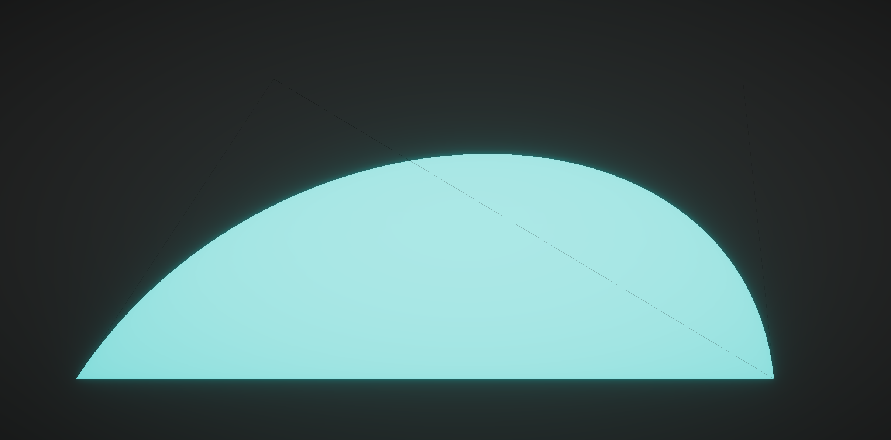

# Unity GPU Vector Graphics

This is a GPU accelerated vector graphics library built specifially for the Unity3D engine.

- [Unity GPU Vector Graphics](#unity-gpu-vector-graphics)
  - [Installation](#installation)
  - [Support the project!](#support-the-project)
  - [Join the community!](#join-the-community)
  - [License](#license)
  - [References](#references)

## Installation

This package depends on the [UnityUtil](https://github.com/voxell-tech/UnityUtil) package.

1. Clone the [UnityUtil](https://github.com/voxell-tech/UnityUtil) repository into your `Packages` folder.
2. Clone this repository into your `Packages` folder.
3. And you are ready to go!

## Support the project!

## Join the community!

## License

This repository as a whole is licensed under the Apache License 2.0. Individual files may have a different, but compatible license.

See [license file](./LICENSE) for details.

## References

1. [Gliss (GitHub)](https://github.com/mdk/gliss)
2. [GPU Curve Rendering (GitHub)](https://github.com/azer89/GPU_Curve_Rendering)
3. [Resolution Independent Curve Rendering using Programmable Grpahics Hardware](https://www.microsoft.com/en-us/research/wp-content/uploads/2005/01/p1000-loop.pdf)